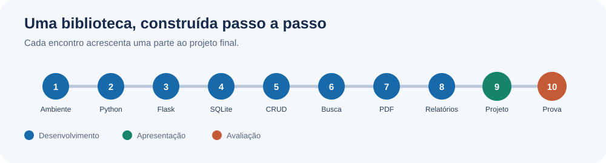
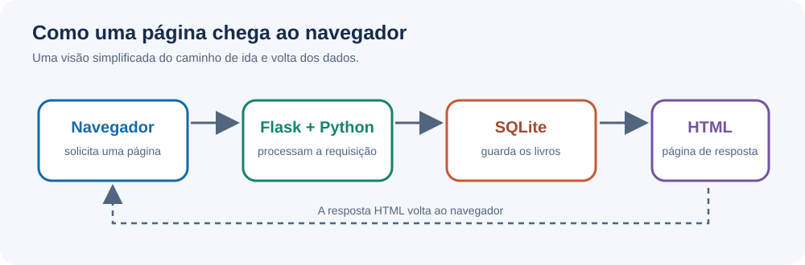
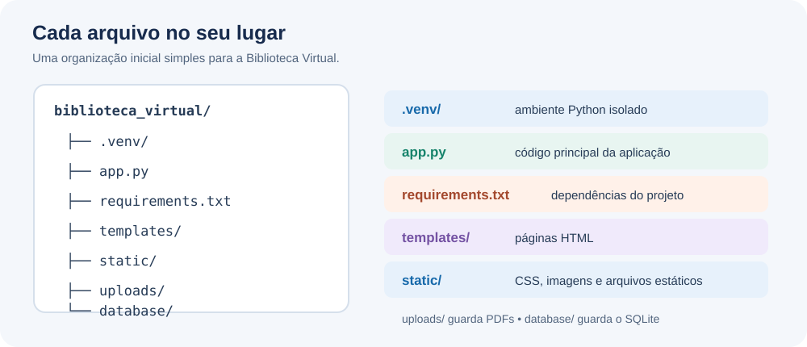

# Aula 1 — Apresentação da disciplina, ambiente e primeiro projeto

**Data:** 15/10/2026  
**Tema:** visão geral da disciplina, projeto final, preparação completa do Windows e organização inicial do projeto.

## Objetivos da aula

- compreender o que será construído durante as 10 semanas;
- diferenciar cadastro, busca, relatório e armazenamento de arquivos;
- conhecer a stack da disciplina;
- instalar e testar todas as ferramentas que serão utilizadas;
- criar uma pasta de projeto organizada;
- criar e ativar um ambiente virtual Python;
- instalar Flask;
- executar uma primeira aplicação web local.

---

## 1. O que será construído?

Durante a disciplina criaremos, passo a passo, uma **Biblioteca Virtual**.

A aplicação final não pretende substituir um sistema profissional de biblioteca. O objetivo é reunir, em um único projeto, os principais conceitos introdutórios de programação web e banco de dados.

O sistema deverá permitir:

1. cadastrar livros;
2. listar livros cadastrados;
3. visualizar os dados de um livro;
4. editar um cadastro;
5. excluir um cadastro;
6. pesquisar por título;
7. filtrar por autor, ano e categoria;
8. anexar um arquivo PDF ao livro;
9. baixar o PDF armazenado;
10. apresentar relatórios em quadros ou tabelas, como quantidade total de livros e quantidade agrupada por autor, ano e categoria.

### Modelo mínimo de Livro

Cada livro deverá possuir, pelo menos:

- `id`;
- `titulo`;
- `autor`;
- `ano`;
- `categoria`;
- `editora`;
- `descricao`;
- `arquivo_pdf`.

O `id` será criado automaticamente pelo banco de dados.

---

## 2. Percurso da disciplina

O projeto será desenvolvido gradualmente ao longo da disciplina; a imagem resume o percurso até a apresentação e a prova.



---

## 3. Stack da disciplina

### Python

Será a linguagem principal. Python possui uma sintaxe relativamente enxuta e permite concentrar a atenção na lógica do programa.

Exemplo:

```python
nome = "Dom Casmurro"
ano = 1899

if ano < 2000:
    print("Livro publicado antes do ano 2000")
```

### Flask

Flask será o framework web. Ele recebe requisições do navegador, executa código Python e devolve páginas HTML.

### SQLite

SQLite será o banco de dados. Ele não precisa de um servidor separado e trabalha com um arquivo local, por exemplo:

```text
biblioteca.db
```

O Python já inclui o módulo `sqlite3`, então não será necessário instalar um servidor MySQL ou PostgreSQL.

### HTML e Jinja2

HTML cria a estrutura das páginas. Jinja2 permite inserir dados vindos do Python dentro do HTML.

Exemplo:

```html
<h1>{{ livro.titulo }}</h1>
```

### Bootstrap

Bootstrap será usado apenas para facilitar a aparência das páginas. Utilizaremos a versão via CDN; portanto, não será necessário instalar Node.js ou pacotes JavaScript.

### Git e GitHub

Git será usado para controle de versão. GitHub poderá ser usado para armazenar e entregar o projeto.



---

## 4. Preparação de um Windows 10 ou superior completamente limpo

Para esta disciplina, instale as ferramentas abaixo.

### 4.1 Navegador

Windows 10 e 11 já incluem o Microsoft Edge. Chrome ou Firefox podem ser usados, mas não são obrigatórios.

### 4.2 Python

Instale uma versão estável atual do **Python 3** para Windows.

Após a instalação, abra o **Prompt de Comando** e execute:

```bat
py --version
```

Se o comando `py` não estiver disponível, tente:

```bat
python --version
```

O resultado deverá indicar Python 3.x.

Em seguida:

```bat
py -m pip --version
```

Isso confirma que o gerenciador de pacotes `pip` está disponível.

> Nesta disciplina, usem sempre Python 3. Não vamos usar outras versões do Python.

### 4.3 Visual Studio Code

Instale o **Visual Studio Code**.

Após abrir o programa:

1. abra a aba de extensões;
2. procure por **Python**, publicada pela Microsoft;
3. instale a extensão;
4. opcionalmente, instale **SQLite Viewer** ou extensão equivalente apenas para inspecionar visualmente o banco.

A extensão de SQLite é opcional: o projeto não depende dela.

### 4.4 Git

Instale **Git for Windows**.

Depois, feche e reabra o Prompt de Comando e execute:

```bat
git --version
```

Configure seu nome:

```bat
git config --global user.name "Seu Nome"
```

Configure seu e-mail:

```bat
git config --global user.email "seu-email@exemplo.com"
```

### 4.5 Conta no GitHub

Uma conta gratuita no GitHub é recomendada para entrega do projeto e backup do código.

Não é necessário GitHub Pro.

---

## 5. Criando a pasta da disciplina

No Prompt de Comando:

```bat
cd %USERPROFILE%\Documents
mkdir biblioteca_virtual
cd biblioteca_virtual
```

Abra a pasta no VS Code:

```bat
code .
```

Se `code .` não funcionar, abra o VS Code manualmente e utilize **Arquivo > Abrir Pasta**.

---

## 6. Criando um ambiente virtual

Um ambiente virtual isola os pacotes utilizados pelo projeto.

Dentro da pasta do projeto:

```bat
py -m venv .venv
```

No Prompt de Comando tradicional (`cmd.exe`), ative com:

```bat
.venv\Scripts\activate.bat
```

O terminal deverá mostrar algo semelhante a:

```text
(.venv) C:\Users\Aluno\Documents\biblioteca_virtual>
```

Para sair do ambiente virtual:

```bat
deactivate
```

> Sempre que for trabalhar no projeto em outro dia, entre na pasta e ative `.venv` novamente.

---

## 7. Instalando Flask

Com o ambiente virtual ativo:

```bat
py -m pip install Flask
```

Confirme:

```bat
py -m pip show Flask
```

Crie também o arquivo `requirements.txt`:

```text
Flask>=3.1,<4
```

Em uma máquina nova, os pacotes poderão ser restaurados com:

```bat
py -m pip install -r requirements.txt
```

---

## 8. Primeira organização do projeto

Use a imagem como referência para criar os arquivos e as pastas do projeto. Nas próximas etapas, você preencherá cada parte.



---

## 9. Primeiro Flask

No arquivo `app.py`:

```python
from flask import Flask

app = Flask(__name__)

@app.route("/")
def inicio():
    return "Biblioteca Virtual funcionando!"

if __name__ == "__main__":
    app.run(debug=True)
```

Execute:

```bat
py app.py
```

Abra no navegador:

```text
http://127.0.0.1:5000
```

Se aparecer a frase **Biblioteca Virtual funcionando!**, o ambiente está preparado.

Para encerrar o servidor no terminal, pressione:

```text
Ctrl + C
```

---

## 10. Primeiro arquivo HTML

Em `templates/index.html`:

```html
<!doctype html>
<html lang="pt-BR">
<head>
    <meta charset="utf-8">
    <title>Biblioteca Virtual</title>
</head>
<body>
    <h1>Biblioteca Virtual</h1>
    <p>Projeto da disciplina.</p>
</body>
</html>
```

Altere `app.py`:

```python
from flask import Flask, render_template

app = Flask(__name__)

@app.route("/")
def inicio():
    return render_template("index.html")

if __name__ == "__main__":
    app.run(debug=True)
```

Recarregue a página.

---

## 11. Iniciando o Git

Ainda na pasta do projeto:

```bat
git init
```

Crie `.gitignore`:

```text
.venv/
__pycache__/
database/*.db
uploads/*
!uploads/.gitkeep
```

Depois:

```bat
git add .
git commit -m "Aula 1 - estrutura inicial"
```

O repositório no github já deverá estar preparado para as próximas aulas.
Pra quem ainda não souber, fica como tarefa de casa aprender a realizar um push e criar uma conta github.

---

## 12. Atividade prática

O aluno deverá entregar uma captura de tela ou demonstrar ao professor:

- Python funcionando;
- Git funcionando;
- VS Code aberto na pasta do projeto;
- ambiente `.venv` criado;
- Flask instalado;
- estrutura de pastas criada;
- página inicial sendo exibida no navegador.

### Desafio opcional

Altere `index.html` para exibir:

- nome da biblioteca;
- nome do aluno;
- uma frase explicando a finalidade do sistema.

---

## Deixar pronto antes da próxima aula

- [ ] Python instalado e testado
- [ ] VS Code instalado
- [ ] extensão Python instalada
- [ ] Git instalado e configurado
- [ ] pasta `biblioteca_virtual` criada
- [ ] `.venv` funcionando
- [ ] Flask instalado
- [ ] primeira rota funcionando
- [ ] primeiro commit realizado

Próxima aula: Antes de avançarmos no Flask, aprenderemos(ou iremos rever) os fundamentos de Python que serão usados no restante do projeto.
